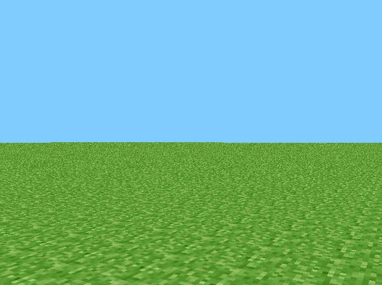

# mc-preclassic-c
**RubyDung (aka MC Preclassic) rewritten as God intended.**

---

  

---

## What the hell is this?
This is me being insane enough to rewrite the very first public Minecraft version  
**rd-132211**, released May 2009, in plain C.  

Why? Because I can.  
And because the original was Java, and I wanted to see how far I could push a C port.  

I kept file names and code organization close to the original repo:  
[thecodeofnotch/rd-132211](https://github.com/thecodeofnotch/rd-132211).  

---

## Features
- Break and place tiles  
- White flashing overlay on the block you’re aiming at  
- Save the level by pressing **Enter**  
- Respawn/reset position by pressing **R**  

---

## Building
Tested on **Windows**, works fine.  

### Windows
You’ll need MinGW (or similar). Then:  
```bash
make BUILD=release
```

To run the game, make sure these DLLs are in the same folder as the exe:
- `zlib1.dll`
- `libwinpthread-1.dll`
- `glew32.dll`
- `glfw3.dll`

### Linux
Probably just:
```bash
make
./rubydung
```
It may not compile, I'll need to check for myself first.

---

## References
- [Wiki: Java Edition pre-Classic rd-132211](https://minecraft.fandom.com/wiki/Java_Edition_pre-Classic_rd-132211)  
- [Original source drop by Notch](https://github.com/thecodeofnotch/rd-132211)  

---

If you think this is a dumb project, you’re right. But it runs.  

Now moving on to **rd-132328** — next version in the timeline.
