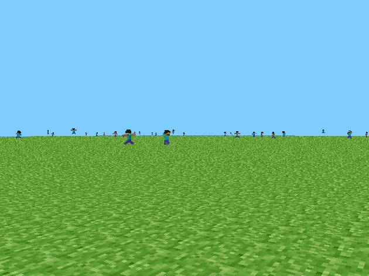
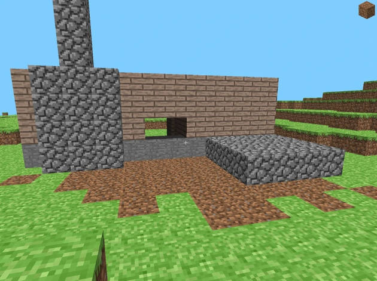
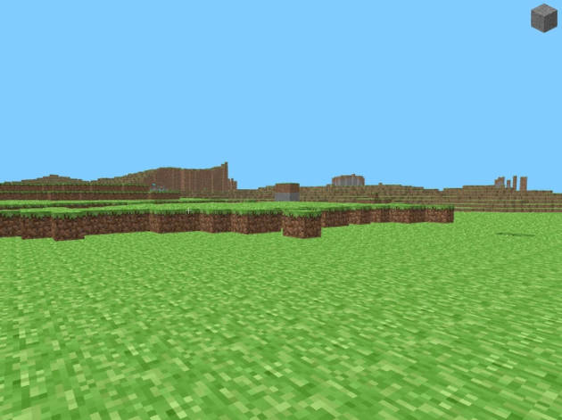
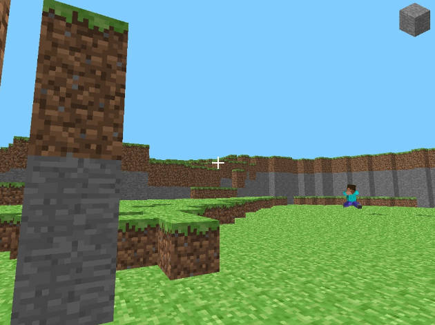

# mc-preclassic-c
**RubyDung (aka MC Preclassic) rewritten as God intended.**

---

  

---

## What the hell is this?
This is me being insane enough to rewrite the very first public Minecraft versions  
**rd-132211**, **rd-132328**, **rd-20090515**, **rd-160052**, **rd-161348** released 2009, in plain C.

Why? Because I can.  
And because the original was Java, and I wanted to see how far I could push a C port.  

I kept file names and code organization close to the original repos:  
[GitHub: thecodeofnotch](https://github.com/thecodeofnotch)

---

## Versions covered

### rd-132211
- Break and place tiles  
- White flashing overlay on the block you’re aiming at  
- Save the level by pressing **Enter**  
- Respawn/reset position by pressing **R**  

<details>
<summary>Screenshot</summary>


</details>

### rd-132328
- Player movement/collision factored into a common `Entity` base (player now “inherits” physics).
- Minimal immediate-mode box builder used for characters.
- A simple biped (“zombie/human”) that wanders the world with basic hopping/striding animation.

<details>
<summary>Screenshot</summary>



</details>

### rd-20090515
- General
    - Game tick is now 20 ticks per second
    - Fullscreen mode
    - Custom textures for each face of a tile
    - Added stone, dirt and wood tile
- Entity
    - Reduced zombie spawn amount to 10
    - Zombies who fall below y level -100 are now removed from the world
    - Modified physics of entities
    - Zombies now appear darker in the shadow
- World
    - Implemented perlin noise world generation
    - Grass can grow on dirt tiles in sunlight
- Controls
    - Added hotkey "G" to spawn zombies
    - Block picking using the number keys 1-4
- HUD
    - Crosshair
    - Picked tile in the top right corner

<details>
<summary>Screenshot</summary>



</details>

### rd-160052
- Add tile destroy particles

<details>
<summary>Screenshot</summary>



</details>

### rd-161348
- Added bush tile
- Changed HUD scale
- Flipped tile preview
- Rotate particles to the y camera position

<details>
<summary>Screenshot</summary>



</details>

---

## Building

### Windows

#### Install MSYS2
Download and install from [msys2.org](https://www.msys2.org/).

#### Open the right shell
Launch **“MSYS2 MinGW x64”** (the icon says *MINGW64*).  
:warning: Do **not** use the plain “MSYS2 MSYS” shell.

#### Update and install toolchain + libraries
```bash
pacman -Syu                    # if it asks, close the window and reopen MINGW64, then run again
pacman -S --needed \
  mingw-w64-x86_64-toolchain \
  mingw-w64-x86_64-glfw \
  mingw-w64-x86_64-glew \
  mingw-w64-x86_64-zlib \
  make
```

#### Build
```bash
git clone https://github.com/degradka/mc-preclassic-c.git
cd mc-preclassic-c/rd-[version]/src/
make
```

To run the game, make sure these DLLs are in the same folder as the exe:
- `zlib1.dll`
- `libwinpthread-1.dll`
- `glew32.dll`
- `glfw3.dll`

Don't forget that `resources/` folder should also be in the same folder.

### Linux
> Tested on Arch Linux — other distros may need different package names.

#### Install dependencies

```bash
sudo pacman -S glew glfw
```

#### Build
```bash
git clone https://github.com/degradka/mc-preclassic-c.git
cd mc-preclassic-c/rd-[version]/src/
make
```

Don't forget that `resources/` folder should also be in the same folder.

---

## References
- [Wiki: Java Edition pre-Classic rd-132211](https://minecraft.fandom.com/wiki/Java_Edition_pre-Classic_rd-132211)
- [Wiki: Java Edition pre-Classic rd-132328](https://minecraft.fandom.com/wiki/Java_Edition_pre-Classic_rd-132328)
- [Wiki: Java Edition pre-Classic rd-20090515](https://minecraft.fandom.com/wiki/Java_Edition_pre-Classic_rd-20090515)
- [Wiki: Java Edition pre-Classic rd-160052](https://minecraft.fandom.com/wiki/Java_Edition_pre-Classic_rd-160052)
- [Wiki: Java Edition pre-Classic rd-161348](https://minecraft.fandom.com/wiki/Java_Edition_pre-Classic_rd-161348)
- [GitHub: The Code of Notch rd-132211](https://github.com/thecodeofnotch/rd-132211)
- [GitHub: The Code of Notch rd-132328](https://github.com/thecodeofnotch/rd-132328)
- [GitHub: The Code of Notch rd-20090515](https://github.com/thecodeofnotch/rd-20090515)
- [GitHub: The Code of Notch rd-160052](https://github.com/thecodeofnotch/rd-160052)
- [GitHub: The Code of Notch rd-161348](https://github.com/thecodeofnotch/rd-161348)

---

If you think this is a dumb project, you’re right. But it runs.
