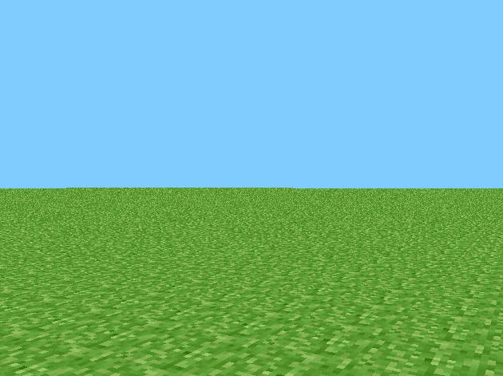

# mc-preclassic-c
**RubyDung (aka MC Preclassic) rewritten as God intended.**

---

  

---

## What the hell is this?
This is me being insane enough to rewrite the very first public Minecraft versions  
**rd-132211**, **rd-132328** released May 2009, in plain C.

Why? Because I can.  
And because the original was Java, and I wanted to see how far I could push a C port.  

I kept file names and code organization close to the original repo:  
[thecodeofnotch/rd-132211](https://github.com/thecodeofnotch/rd-132211).

---

## Versions covered

### rd-132211
- Break and place tiles  
- White flashing overlay on the block you’re aiming at  
- Save the level by pressing **Enter**  
- Respawn/reset position by pressing **R**  

### rd-132328
- Player movement/collision factored into a common `Entity` base (player now “inherits” physics).
- Minimal immediate-mode box builder used for characters.
- A simple biped (“zombie/human”) that wanders the world with basic hopping/striding animation.

### rd-20090515
- General
    - Game tick is now 20 ticks per second
    - Fullscreen mode
    - Custom textures for each face of a tile
    - Added stone, dirt and wood tile
- Entity
    - Reduced zombie spawn amount to 10
    - Zombies who fall below y level -100 are now removed from the world
    - Modified physics of entities
    - Zombies now appear darker in the shadow
- World
    - Implemented perlin noise world generation
    - Grass can grow on dirt tiles in sunlight
- Controls
    - Added hotkey "G" to spawn zombies
    - Block picking using the number keys 1-4
- HUD
    - Crosshair
    - Picked tile in the top right corner

### rd-160052
- Add tile destroy particles

### rd-161348
- Added bush tile
- Changed HUD scale
- Flipped tile preview
- Rotate particles to the y camera position

---

## Building
Tested on **Windows**, works fine.  

### Windows
You’ll need MinGW (or similar). Then:  
```bash
make
```

To run the game, make sure these DLLs are in the same folder as the exe:
- `zlib1.dll`
- `libwinpthread-1.dll`
- `glew32.dll`
- `glfw3.dll`

### Linux
Probably just:
```bash
make
./rubydung
```
It may not compile, I'll need to check for myself first.

---

## References
- [Wiki: Java Edition pre-Classic rd-132211](https://minecraft.fandom.com/wiki/Java_Edition_pre-Classic_rd-132211)  
- [The Code of Notch repo](https://github.com/thecodeofnotch/rd-132211)  

---

If you think this is a dumb project, you’re right. But it runs.
